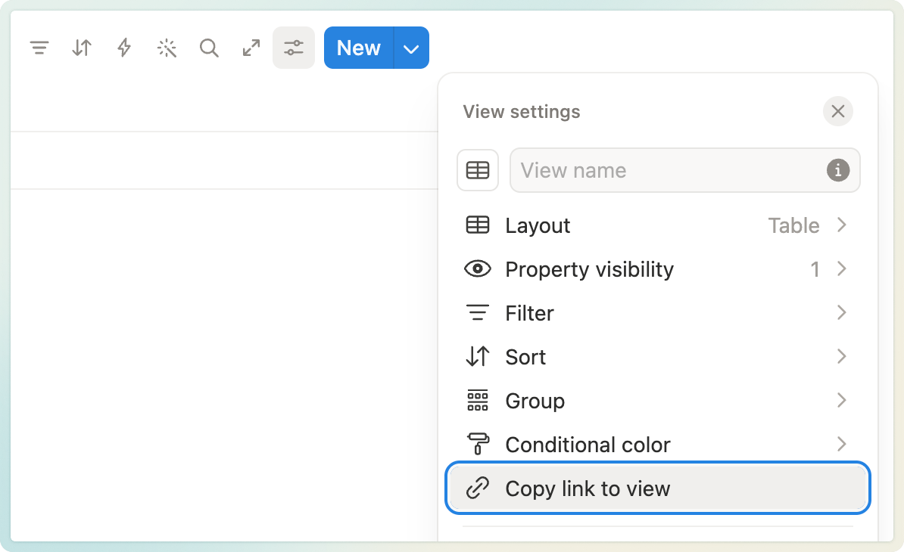

# Markdown to Notion GitHub Action

Sync a folder of Markdown files to Notion pages in a Notion database.

This action:

- Creates or updates one Notion database page per Markdown file.
- Stores sync state in database properties such as `Path`, `Repository`, and `Source Hash`.
- Archives stale Notion pages when their Markdown file no longer exists.
- Optionally supports the previous parent-page mode with `page_id` or `page_block_id`.
- Skips private Markdown files by file-name prefix, `_` by default.
- Validates links to avoid Notion "Invalid URL" errors.

## Quick Start (Beginner)

1. **Create a Notion Integration**

- Go to Notion settings → Connections → Develop or manage integrations.
- Create a new integration and copy the **Internal Integration Token**.

2. **Create or choose a Notion database**

- Use a full-page database, or use an inline database and copy its view link.
- Share the database with the Notion integration.

3. **Copy the database ID**

- Full-page database: copy the database page URL and use the 32-character ID in the URL path.
- Inline database: open the table view settings, click **Copy link to view**, and use the 32-character ID before `?v=`.

4. **Add a GitHub workflow**

```yaml
name: Sync Docs to Notion

on:
  push:
    branches:
      - "main"
    paths:
      - "docs/**"

permissions:
  contents: read

jobs:
  sync:
    runs-on: ubuntu-latest
    steps:
      - uses: actions/checkout@v6
      - name: Sync markdown to Notion
        uses: cvscarlos/markdown-to-notion-action@v3
        with:
          github_token: ${{ secrets.GITHUB_TOKEN }}
          notion_token: ${{ secrets.NOTION_TOKEN }}

          # Creates one Notion database page per Markdown file.
          database_id: ${{ secrets.NOTION_DATABASE_ID }}

          # Optional: folder containing markdown files (default: docs)
          docs_folder: docs
          # Optional: skip markdown files whose file name starts with this prefix (default: _)
          private_markdown_prefix: "_"
          # Optional: separator used between folder names and title (default: →)
          title_prefix_separator: "→"
```

## Inputs

| Input                     | Required | Description                                                                                            |
| ------------------------- | -------- | ------------------------------------------------------------------------------------------------------ |
| `notion_token`            | Yes      | Notion Integration Secret.                                                                             |
| `docs_folder`             | No       | Folder containing Markdown files (relative to the repository root). Default: `docs`.                   |
| `database_id`             | No       | Notion database ID/URL where Markdown files are created as database pages. Recommended for new setups. |
| `page_block_id`           | No       | Legacy anchor block ID/URL. The action appends shortcut (`link_to_page`) blocks after this block.      |
| `page_id`                 | No       | Legacy parent page ID/URL for new pages. Pages are created at the end of the parent page.              |
| `private_markdown_prefix` | No       | Markdown file-name prefix to skip. Default: `_`. Set to `"null"`, `"none"`, or `"false"` to disable.   |
| `title_prefix_separator`  | No       | Separator used between folder names and the title. Default: `→`.                                       |
| `github_token`            | No       | Used to read private GitHub repository files for image uploads and file commit timestamps.             |

**Requirement:** Provide `database_id` for database-backed sync, or provide `page_block_id`/`page_id` for the legacy parent-page mode.

Deprecated inputs accepted for backward compatibility but ignored: `notion_mapping_file`, `commit_strategy`, `pr_branch_prefix`.

## How It Works

### 1) Identification

The action uses Notion as the durable source of truth. In database mode, each Markdown file is represented by one database page. The database stores the sync record in properties:

- `Path`
- `Repository`
- `Source Hash`
- `Source URL`
- `Last Synced At`

On each run, the action queries the database once with pagination, builds a local path-to-page map, and syncs only pages whose source hash changed. When a new Markdown page is created, the database row is created before the Markdown blocks are uploaded, so later workflow runs can find the page even if the previous run failed after page creation.

If a database row does not exist yet, the action first tries to match an existing database page by the generated Notion page title. Matching only happens for unique titles; duplicate titles are ignored to avoid attaching a Markdown file to the wrong page.

Legacy parent-page mode still stores sync state inside a child page named `_Markdown to Notion Sync Data (do not edit)`.

### 2) Private Markdown Files

By default, markdown files whose file name starts with `_` are skipped.

Examples skipped by default:

```text
docs/_draft.md
docs/platform/_internal.md
```

To disable this behavior:

```yaml
with:
  private_markdown_prefix: "null"
```

### 3) Title Selection

The page title is chosen in this order:

1. First Markdown H1 heading
2. File name (without extension)

### 4) Markdown to Notion Blocks

Supported conversions include:

- Headings (H1/H2/H3)
- Paragraphs
- Bulleted and numbered lists (with nesting)
- Code fences
- Blockquotes (paragraphs inside)
- Horizontal rules
- Tables
- `Table of Contents` / `[TOC]` placeholders → Notion `table_of_contents` block

**Folder titles:**

- `docs/platform/overview.md` becomes a page titled `platform → Overview` (separator configurable).

**Safety rules:**

- Text is split into chunks ≤ 2000 characters.
- Links are validated. Invalid or relative links are dropped (text is preserved).

### 5) Index Block (Optional)

Database mode does not need an index block because the database is already the listing. If `page_block_id` is also provided, the action can still replace the contiguous `link_to_page` shortcut blocks **after** that block. The anchor block itself is not modified.

### 6) Deleted or Renamed Markdown Files

If a path exists in the Notion database properties but the Markdown file no longer exists in `docs_folder`, the action treats that path as stale.

- The stale Notion page is archived.
- In database mode, the archived database page remains in Notion trash/history according to Notion behavior.
- If the page was already deleted or archived manually in Notion, the action removes the stale in-memory record and continues.

A rename is treated the same as delete + create because the action cannot safely know whether a missing path was renamed or deleted.

## Version Tags

This repository uses Git tags for versions. GitHub does not always show tag labels on the commits list, so use the Tags page to find the latest version:

- GitHub → **Releases → Tags** or **Code → Tags**
- The manual release workflow attempts to move the floating `v3` tag to the latest `v3.x.x` release.
- If that step fails or GitHub keeps the wrong ref cached, run `./.github/update-v3-tag.sh` locally as a fallback.

## Notion ID Tips

You can pass a database/block/page ID **or** a Notion URL. The action extracts the ID automatically.

Example formats:

- `b3c7a87c7eaa4ec4a23e1e6c20a12345`
- `b3c7a87c-7eaa-4ec4-a23e-1e6c20a12345`
- `https://www.notion.so/7754cf02251f4bc9ab2f9cc897765336` (URL that contains the ID)

To get a block ID:

- In Notion, click **Copy Link to Block**.

To get a full-page database ID, copy the database page URL and use the 32-character ID in the URL path. Ignore the `v=` value; that is the view ID.

To get an inline database ID, open the table view settings and click **Copy link to view**. Use the 32-character ID before `?v=` and ignore the `v=` value.



### Useful Scripts

- `npm run lint`
- `npm run format`
- `npm run format:check`
- `npm run typecheck`
- `npm run knip`
- `npm run precommit`
- `npm run hooks:install` to enable the local Git pre-commit hook
- `./.github/update-v3-tag.sh`

## Troubleshooting

### "Invalid URL for link"

This action validates links and drops invalid/relative URLs instead of crashing. If you want relative links to resolve to Notion pages, make sure the target Markdown files have already been synced so their page IDs exist in the database properties or legacy sync-state page.

### "Either database_id, page_block_id, or page_id must be provided"

Set `database_id` for new setups. Use `page_id` or `page_block_id` only for the legacy parent-page mode.

### "Not found" errors from Notion

Make sure the integration has access to the target database/page/block (Share → invite the integration).

### "Nothing syncs even though I expected changes"

The action skips syncing a page if its `Source Hash` database property matches the current Markdown content. In legacy parent-page mode, the same check uses the Notion sync-state page.

If the hash changed but Notion is newer than the file's last commit time, the action also skips syncing to avoid overwriting manual Notion edits.

In GitHub Actions it checks the latest commit for that file via the GitHub commits API first, so a full clone is not required.

If the GitHub API lookup is unavailable, it falls back to local `git log`, which may require enough local history to reach the file's last change.

## Behavior Notes

- In database mode, Notion database properties are the source of truth for page IDs and hashes.
- In legacy parent-page mode, the Notion sync-state page remains the source of truth.
- The index link list after `page_block_id` is replaced each run (contiguous `link_to_page` blocks only).
- Pages are skipped when the source hash is unchanged.
- Pages are also skipped when Notion is newer than the last Git commit time.
- If a Markdown path is renamed or deleted, the old Notion page is archived unless that same page ID is still referenced by another active Markdown file.
- If a block append fails, the action logs a warning and continues.
- HTML in Markdown is not preserved.

## License

MIT
